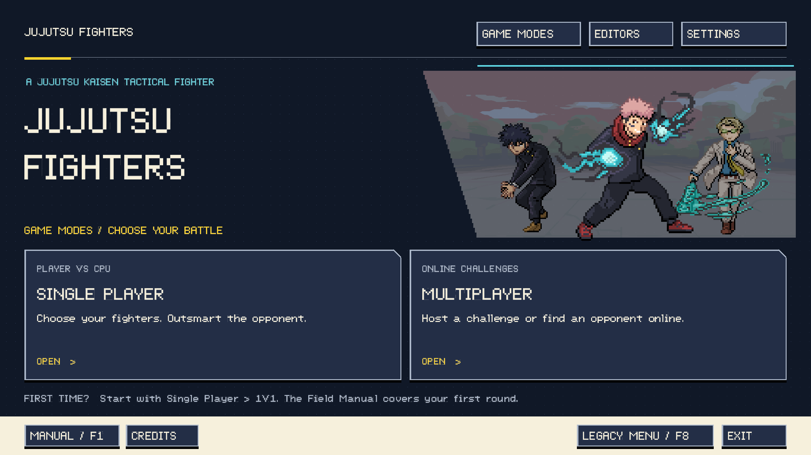
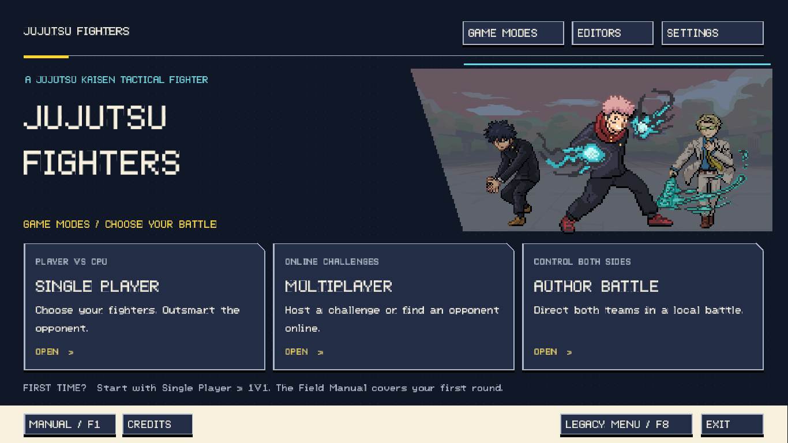
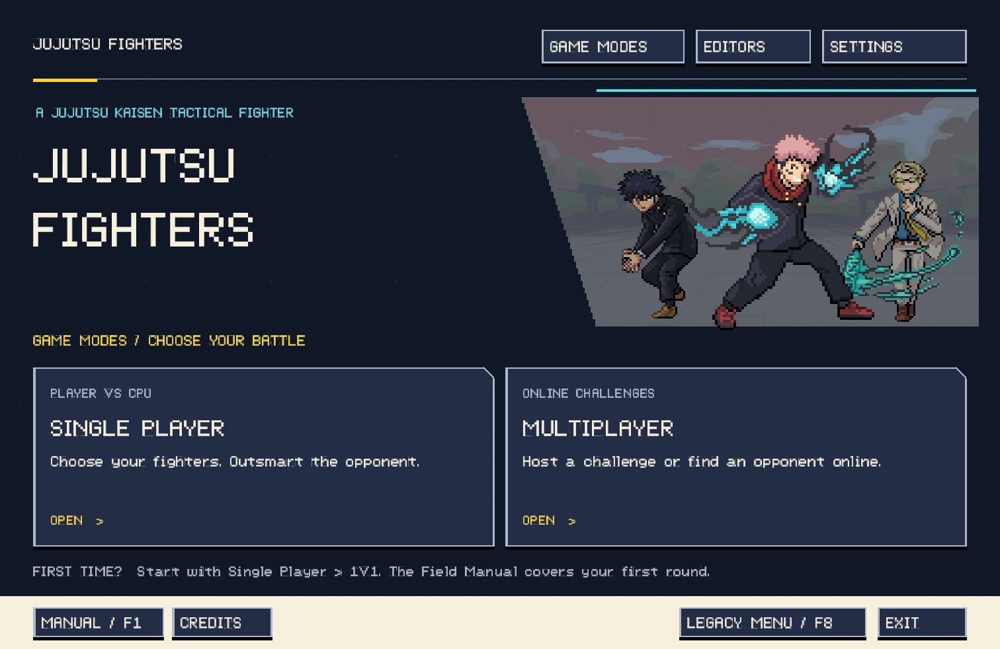
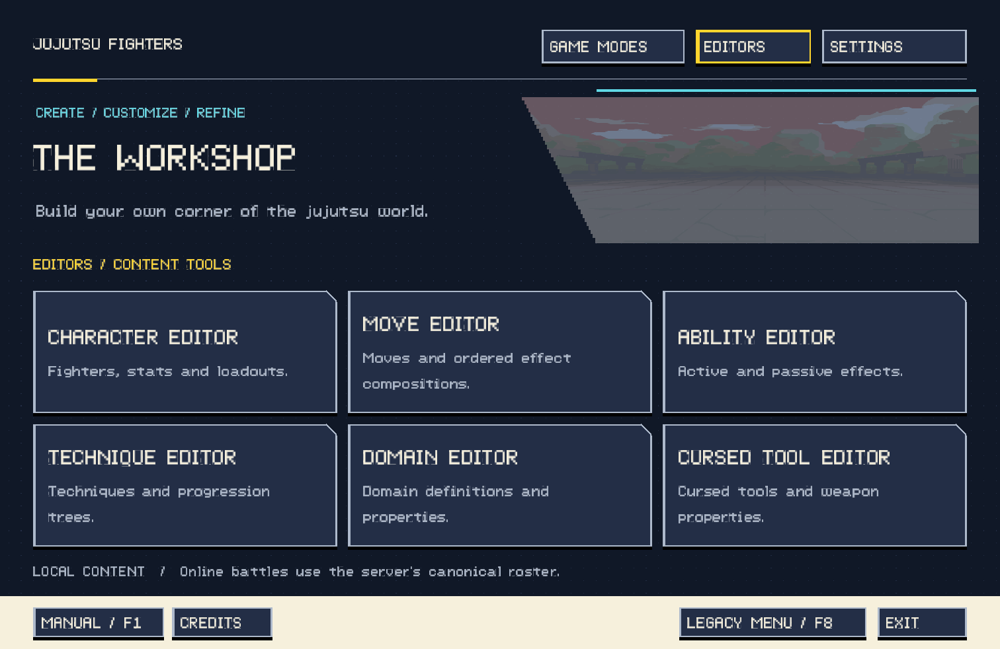
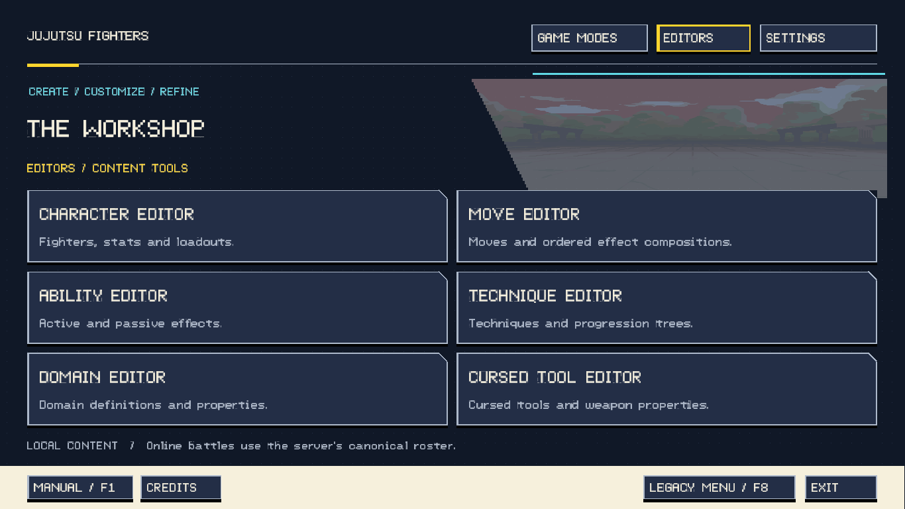

# Main Menu redesign — evaluation guide

The redesigned menu is a **separate, reversible presentation variant**. The legacy
`MainMenuScreen` remains in the project and uses the same navigation destinations.

## Switching

- **Press F8 on either main menu.** On Macs where function keys control hardware,
  use **Fn-F8**, or click the menu-variant button.
- Redesigned: click **LEGACY MENU / F8** in the footer.
- Legacy: click **REDESIGNED MENU [F8]** in the secondary strip below the header.
- The selection is saved in LibGDX's `jjktbf-menu` preferences, key `variant`, and
  is restored on the next launch. The initial evaluation default is **REDESIGNED**.
- For a specific launch, use `-Djjktbf.mainMenu=LEGACY` or
  `-Djjktbf.mainMenu=REDESIGNED`. The launch property takes precedence over the saved
  choice **at startup only**; F8 still works within that session. Remove the launch
  property to resume the saved preference on subsequent launches.

Example on macOS (use the version produced by your build):

```bash
java -XstartOnFirstThread -Djjktbf.mainMenu=LEGACY -jar graphics/target/graphics-1.5.3.jar
```

Windows uses the same command without `-XstartOnFirstThread`.

### Optional Author Battle

Author Battle appears only when `AppPaths.isAuthoringMode()` permits it. To evaluate
the layout with it hidden while retaining authoring permissions elsewhere:

```bash
java -XstartOnFirstThread -Djjktbf.authoring=true -Djjktbf.menu.authorBattle=false -jar graphics/target/graphics-1.5.3.jar
```

Omit `jjktbf.menu.authorBattle=false` to restore the entry in an authoring build.
The flag cannot grant authoring permissions. Both menus filter the same route
catalog before layout; there is no placeholder for an unavailable mode.

## Audit and design rationale

### Existing UI

- **Legacy menu:** Scene2D Stage, shared PixelSkin header and palette, green primary
  button stack, yellow interaction highlight, settings gear, numeric/arrow-key
  shortcuts. Windows uses a reference-size, scrollable stack; Mac uses a Table.
- **Navigation:** `JJKGame` owns all destinations. Single Player opens battle-format
  selection in player-vs-AI mode; Author Battle uses the same flow with human
  control of both teams. Multiplayer opens its existing online challenge hub.
- **Existing editors:** Character, Move, Ability, Technique, Domain, Cursed Tool.
  No extra game modes, campaigns, stores, or editors have been invented.
- **Settings:** the existing shared `SettingsDialogController` provides supported
  Windows resolution selection, battle-music selection, and music/effects volume.
- **Battle / Character Select:** the recent shared gameplay UI uses pixel-art
  fighters, hard-edged ink frames, parchment, CE blue, yellow selection accents,
  and the Atlantis International font. Move cards distinguish categories and
  show descriptions and interaction state within framed surfaces.
- **Display architecture:** menus/editors retain Windows `FitViewport(2560,1440)`
  and Mac `ScreenViewport`; gameplay uses the shared expandable viewport. Native
  desktop resolution, macOS fullscreen, and logical-to-Retina conversion remain
  owned by the launcher/display layer.

### What the supplied references contributed

1. **Stone-framed fantasy menu:** tactile edges and character framing; adapted as
   ink-edged cards and a fighter composition rather than stone buttons.
2. **Warm, atmospheric traditional menu:** a calm text zone against strong imagery,
   restrained accent color, and clear selected-item treatment.
3. **Dashboard/navigation reference:** explicit categories and card-level summaries;
   adapted without the feed, promotional clutter, or many equally weighted rows.
4. **Current JJK menu:** the existing font, green actions, yellow focus, and navy
   panels provide continuity. Its long equal-priority stack is the main hierarchy
   problem addressed by the new variant.

### New structure

```text
JUJUTSU FIGHTERS        GAME MODES | EDITORS | SETTINGS

Illustrated title / courtyard / fighters

GAME MODES
  Single Player       Multiplayer       [Author Battle, if available]

EDITORS (separate tab)
  Character           Move              Ability
  Technique           Domain            Cursed Tool

Footer: Manual | Credits                Legacy Menu | Exit
```

Gameplay occupies the main action area on entry. All available modes use the same
navy treatment and fill the row equally; Single Player retains only its first-battle
hint below the cards. Editors occupy their own workspace instead of competing
with play. The grid reflows from three columns to two at smaller widths, with
more compact descriptions and a shorter hero treatment. Very narrow windows
use stacked mode rows. Text sizes are lifted independently of hero typography.

The illustration reuses Yuji, Megumi and Nanami sprites against the courtyard.
The diagonal panel cut, print-dot texture, and clipped card corners add personality
without competing with the game modes.

## Controls and states

Redesigned menu:

- Mouse click activates a card or shortcut.
- Controls form three keyboard tiers: top navigation, current-page choices, and
  the Manual/Credits/Legacy/Exit footer. Left and Right remain within the current
  tier and page row. Up and Down move between page rows, crossing tiers only above
  the first page row or below the last. Entering another tier always selects its
  leftmost option. Up does nothing in the top tier; Down does nothing in the footer.
  Enter / Space activates keyboard focus.
- Top tabs have no permanent active-page highlight. Hover/keyboard focus adds a
  yellow edge and animated top rule; pressing darkens the surface.
- Disabled controls are muted and do not dispatch actions. Unavailable modes are
  removed rather than presented as dead controls.
- Mouse movement transfers focus to the hovered control, matching Legacy's input
  handoff; moving outside a control clears the highlight.
- Escape returns from Editors to Game Modes. On Game Modes, holding Escape draws
  a clockwise yellow outline around Exit and closes the game when the outline
  completes after **1.25 seconds**. Releasing early cancels and clears the outline.
  Clicking Exit still exits directly.
- F1 opens the offline Field Manual; F2 opens Credits; F8 switches variants.
- Escape closes dialogs; the manual also supports arrow scrolling and Enter to
  close. Settings retains its own text-field and selector input behavior.

Legacy keeps its original stack navigation and numeric shortcuts. It also gains
F1/F2/F8, Space/Tab activation/navigation, and `S` for Settings. The original Mac
stack's height is now bounded by the available height and actual optional row
count, preventing clipping at smaller windows.

## Implementation / asset ownership

New production components:

- `screens/RedesignedMainMenuScreen.java`: new presentation and three-tier navigation.
- `screens/MainMenuSupport.java`: shared settings access, offline manual, credits,
  variant-switch dispatch, and exit behavior.
- `ui/menu/MainMenuAction.java`: shared available-route catalog and dispatch.
- `ui/menu/MainMenuVariant.java`: the reversible presentation choice.
- `ui/menu/MainMenuLayout.java`: viewport-local scale and responsive grid density.
- `ui/menu/MenuTile.java`: interactive card/shortcut with explicit states.
- `ui/menu/MenuIllustration.java`: batched illustration and procedural motifs.

The only new runtime texture is a screen-owned 1×1 white texture used to draw
original procedural framing and motifs. It is disposed with the redesigned
screen. Existing character textures and fonts remain owned by `AssetLoader`.
No downloaded artwork, new font dependencies, shaders, or external asset pipeline
are required. `JJKGame` still owns game/navigation behavior and menu lifecycle.

## Render gallery

These are actual LibGDX/OpenGL menu renders, not mockups. The standalone render
harness draws the screen itself; the application's global version/authoring
overlay is added separately during normal play.

### 2560×1440 — two player modes



### 1920×1080 — two player modes


### 1366×768 — Author Battle enabled



### Mac 1512×982



### Editors — Mac and small Windows layout





## Verification

- Core and graphics unit suites: `mvn -q -pl graphics -am test`.
- `MainMenuPreview`: real GL renders at 2560×1440, 1920×1080, 1366×768 and
  1512×982, both profiles and both author-availability states. Exercises actual
  Stage mouse events for every route, keyboard activation, hover/press/disabled
  states, Settings input, manual/credits, open-modal resize, and F8 dispatch.
  Checks control bounds, overlap and text layout. A separate HiDPI pass renders
  Mac 1512×982 to a 3024×1964 framebuffer.
- `MainMenuNavigationSmoke`: actual `JJKGame.create()`, both variant lifecycles,
  deferred switching, saved preference restored by a new game instance, every
  real menu destination and return, author format handoff and hide flag, and
  exit dispatch. Uses isolated data and in-memory menu preferences.

Reproduce from the repository root on macOS:

```bash
mvn -q -pl graphics -am package
java -XstartOnFirstThread -Djjktbf.data.root=graphics/target/menu-preview-data -cp "graphics/target/test-classes:graphics/target/classes:core/target/classes:graphics/target/graphics-1.5.3.jar" com.jjktbf.graphics.screens.MainMenuPreview
java -XstartOnFirstThread -Djjktbf.data.root=graphics/target/menu-preview-data -Djjktbf.preview.hdpi=2 -cp "graphics/target/test-classes:graphics/target/classes:core/target/classes:graphics/target/graphics-1.5.3.jar" com.jjktbf.graphics.screens.MainMenuPreview
java -XstartOnFirstThread -cp "graphics/target/test-classes:graphics/target/classes:core/target/classes:graphics/target/graphics-1.5.3.jar" com.jjktbf.graphics.screens.MainMenuNavigationSmoke
```

Add `-Djjktbf.preview.gallery=docs/main-menu` to the first preview command to
refresh this six-image gallery. The full state matrix lives under
`graphics/target/main-menu-preview/` and is generated rather than tracked.

Windows-profile rendering was exercised on the Mac OpenGL host. Physical Windows
monitor/DPI behavior and macOS native-fullscreen transitions still merit normal
device testing. Multiplayer validation here covers navigation to the online hub,
not a live two-client network match.

## Evaluate before choosing a permanent replacement

- Does the dark artwork-led direction feel right beside the existing lighter
  character-select/editor screens?
- Is the existing pixel font the desired long-term branding treatment, including
  its intentionally rough large display glyphs?
- Are the fighter trio and restrained motion right for the game's personality?
- The Credits panel is a concise project/series/technology credit; a complete
  contributor and per-asset attribution list can be supplied by the project owner.

**Keep both variants until the user explicitly chooses to remove Legacy.**
